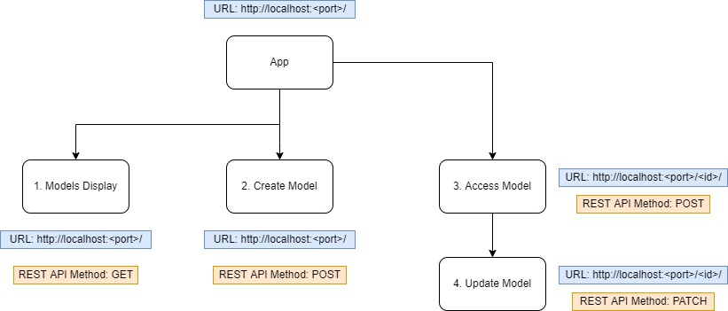

# React.js MUI Core CRUD App

## Application Description

1. It will be a basic CRUD app that will use a mock db using [json-server](https://github.com/typicode/json-server#getting-started) (db.json with mock data is already provided).
2. It should be a responsive SPA with multiple components.

## Application Structure

### Page 1: `http://localhost:<port>:/`

- This page will have two components, `1. Models Display` and `2. Create Models`.
- When this page loads, it should display `1. Models Display`.
- **1. Models Display**
  - It should display all the different models in cards.
  - Add styling to cards to show all the necessary attributes at a glance without confusing the user.
  - At top right corner of the page after the navbar there should be an `add button` for the user to create models, this will invoke the `2. Create Models` component.
  - If a user click the model card, they should be directed to `Page 2` but if they right click on the card, they should get an option: `view model id`.
    - When `view model id` option is selected, just open a modal and display model id and name.
- **2. Create Models**
  - This component will be a redux form with validators.
  - The form should input `name`, `status`, `completion_rate` from the user.
  - Once user submits the data, it should be created in the mock db.

### Page 2: `http://localhost:<port>:/<id>`

- This page will have two components, `3. Access Model` and `4. Update Model`.
- When this page loads, it should display `3. Access Model`.
- **3. Access Model**
  - This component should have a dynamic structure.
  - [ONE COLUMN] It should display data of the respective model.
  - [TWO COLUMNS] After model data, a button should be given to update model data which should display `4. Update Model` in the right column and `3. Access Model` on the left side of the screen .
- **4. Update Model**
  - This component will be similar to `2. Create Model` component but once user updates model, this should update the `updated_at` field and not touch the `created_at` field.
  - Once user updates data, it should be reflected in the mock db

## Use Material UI grid and spacing system and also for every component like cards, navbar, buttons, modal, inputs, etc.

## Use newest version of Material UI with `sx` component

---
